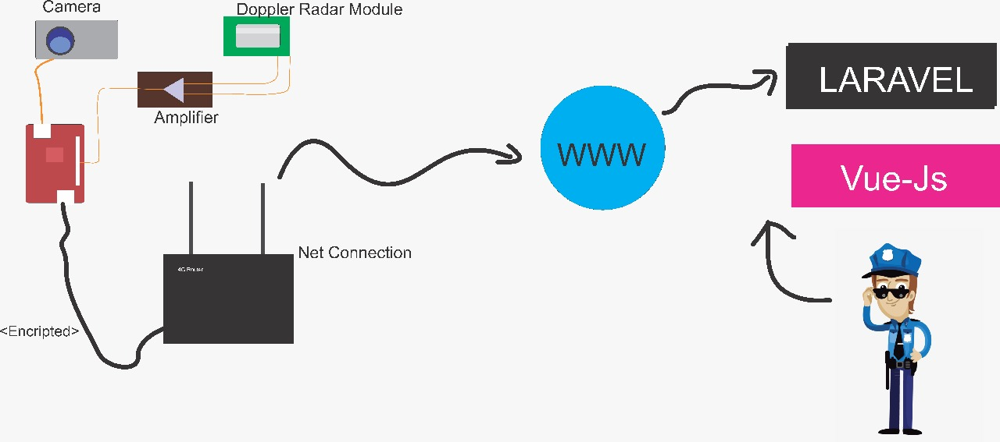
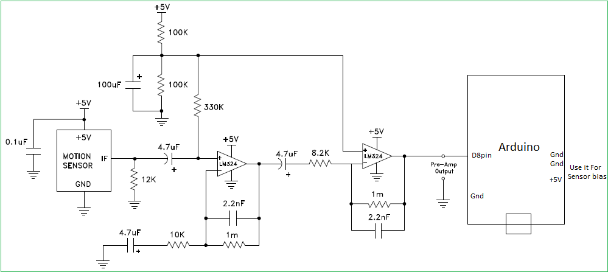
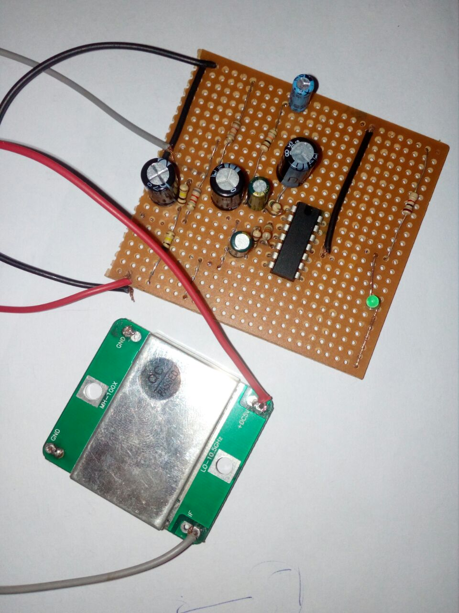

[comment]: # "This is the standard layout for the project, but you can clean this and use your own template"

# Automatic Speed Trap

---

## Team
-  E/14/349, THILAKARATHNA B.R.M., [e14349@ce.pdn.ac.lk](mailto:e14349@ce.pdn.ac.lk)
-  E/14/238, PATHIRAJA P.M.R.I., [e14238@ce.pdn.ac.lk](mailto:e14238@ce.pdn.ac.lk)
-  E/14/352, THILAKAWANSHA B.M.C.P., [e14352@ce.pdn.ac.lk](mailto:e14352@ce.pdn.ac.lk)

## Table of Contents
1. [Introduction](#introduction)
2. [Solution Architecture](#solution-architecture )
3. [Hardware & Software Designs](#hardware-and-software-designs)
4. [Links](#links)

---

## Introduction

Nowadays the transpotation is achieving developments in every alongside. Building highways and developing vehicles with new technologies are two side of developments. As a result of that, the vehicles could be achieved more speed than back days and this highspeed might causes unexpected accidents and might damage human life.

So in this project we are expected to track the vehicle speed and if there any vehicle that travelling with more than maximum speed allowed, take a clear photo of the specific vehicle and send that to authorities to take further action.  

## Solution Architecture

CO321 - Using the embedded system we are expected to measure current speeed of the vehicles. And according to the pre-specified speed limit, check whether the vehicle travels with high speed and if then, using a specific carmera take a clear picture of the vehicle.

CO324 - The photo that took on a specific vehicle, transmitted to a centralized server with the vehicle speed when it was captured. In addition to that few more details will be sent, such as date, time etc.

CO325 - All the transmition are happeninig via encrypted method. Then any other parties cannot access and change the value.  

## Hardware and Software Designs

The overall design can be drawn as below.  
  

Here we have used an amplification system Doppler Sensor Module. That is because the output of the sensor is not enough to measure. The designed circuit and implementation  are shown below.  

  

  

### Documents  
  - [Project Design](data/documents/1.pdf)  
  - [User's Manual](data/documents/2.pdf)  
  - [Project Report](data/documents/3.pdf)  

## Links

- <a href = "https://github.com/cepdnaclk/e14-3yp-Automatic-Speed-Trap" target = "_blank">Project Repository</a>
- <a href = "https://cepdnaclk.github.io/e14-3yp-Automatic-Speed-Trap/" target = "_blank">Project Page</a>
- <a href = "http://www.ce.pdn.ac.lk/" target = "_blank">Department of Computer Engineering</a>
- <a href = "https://eng.pdn.ac.lk/" target = "_blank">University of Peradeniya</a>

[//]: # (Please refer this to learn more about Markdown syntax)
[//]: # (https://github.com/adam-p/markdown-here/wiki/Markdown-Cheatsheet)
